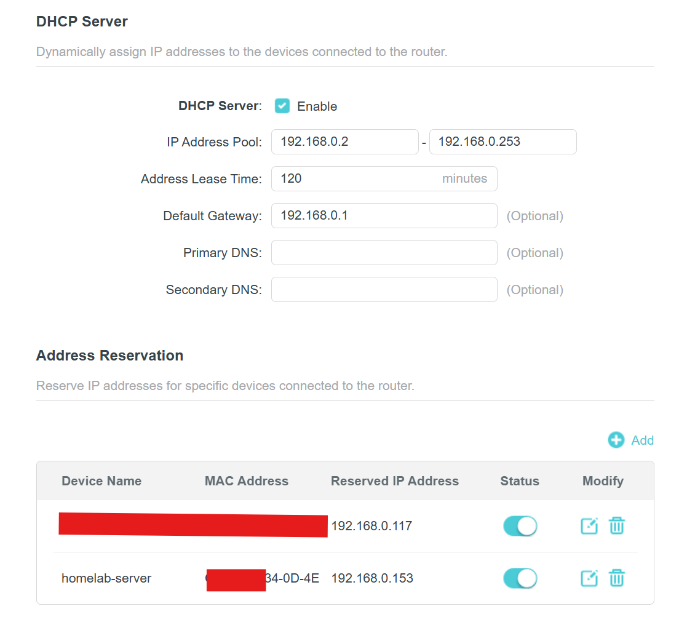
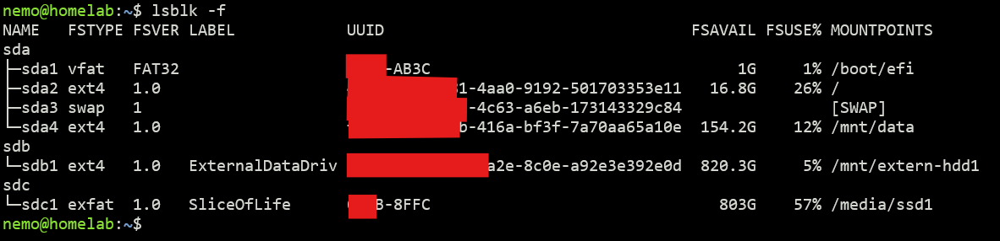

## Assign a fixed IP

Once the server is ready, we need to assign a fixed IP to the server, as the router assigns IP addresses dynamically to connected devices, and we do not want to have a dynamic IP address to the server. So, we tell the router to allocate a fixed IP to the server by adding an Address Reservation entry in the router's DHCP Server settings. This will map the MAC address of the server to a fixed IP. I have assigned 192.168.0.153.



## Move Docker Volume

I moved my Docker volume to the data partition (`/mnt/data`) to accommodate the increasing size of the volumes.

1. Stop the Docker service

   ```sh
   sudo systemctl stop docker
   ```
2. Create/Edit the `/etc/docker/daemon.json` configuration file with the location of the new data directory

   ```sh
    { 
        "data-root": "/mnt/data/docker"
    }
   ```
3. \[Optional\] I also added this DNS entry to fix some issues with network unreachable errors for some containers while installing

   ```sh
   "dns": ["192.168.0.1", "8.8.8.8", "8.8.4.4"]
   ```

   This entry can also be added individually to a particular container. Adding here makes the default for all containers.
4. Move the existing volumes' data to the new folder

   ```sh
   rsync -aP /var/lib/docker/ /mnt/data/docker/
   ```
5. To be safe, instead of deleting the old volume data, we will rename it

   ```sh
   mv /var/lib/docker /var/lib/docker.bak
   ```
6. Start Docker service

   ```sh
   sudo systemctl start docker
   ```
7. Once done, we can verify by checking other containers or running this hello world command

   ```sh
   docker run --rm hello-world
   ```
8. If no errors, the volume move is complete, and we can safely delete the old Docker directory

   ```sh
   sudo rm -rf /var/lib/docker.bak
   ```

## Automount drives

By default, Linux does not automount external drives. We can run `mount` command to manually mount a disk. To automate the mounting every time the system reboots, we need to add entries to the `/etc/fstab` file.

1. Get the UUID

   ```sh
   lsblk -f
   ```

   This will show all drives, including the unmounted ones.

   
2. Grab the UUID of the drive (A12B-8FFC) and make an entry to fstab. Open the fstab file

   ```sh
   sudo vim /etc/fstab
   ```
3. Create the mount directory where the drive will be mounted

   ```sh
   mkdir /mnt/extern-hdd1
   ```
4. Add this line at the end of the file

   ```sh
   UUID=A12B-8FFC /mnt/extern-hdd1 ext4 defaults,nofail,x-systemd.device-timeout=10s,x-systemd.automount 0 2
   ```

   See [fstab documentation](https://man7.org/linux/man-pages/man5/fstab.5.html) for fstab options. The option `x-systemd.automount` is used to mount the drive on boot.
5. Repeat this process for other external drives.
6. Mount all drives in fstab

   ```sh
   sudo mount -a
   ```