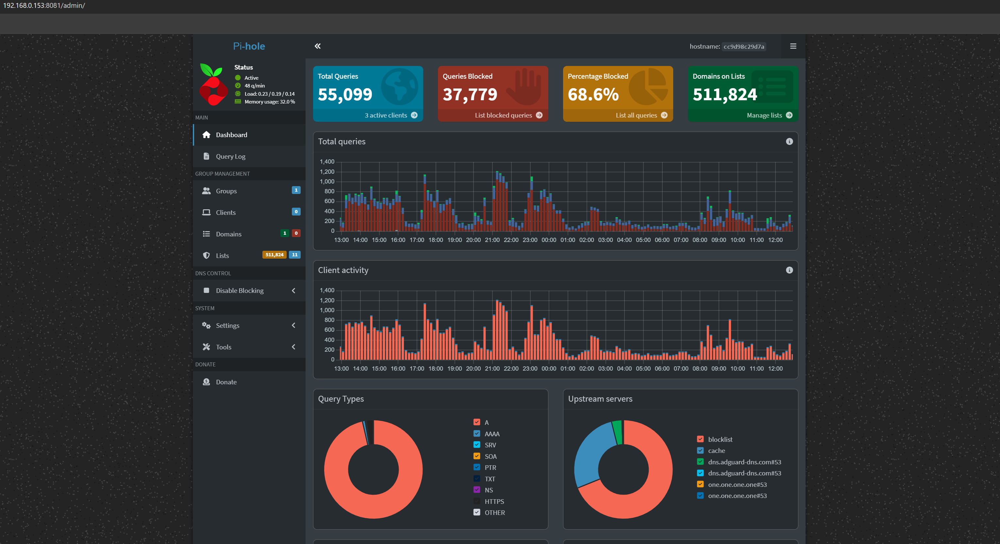
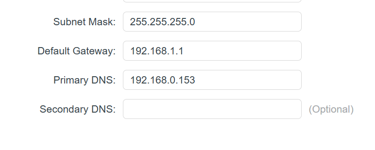

## Install Pi-hole

We will use Docker and Docker Compose to set up Pi-hole and other services.

1. In the home directory, create a `docker` directory and `pihole` inside `docker`.

   ```sh
   cd ~
   mkdir -p docker/pihole
   ```
2. Create the `docker-compose.yml` file

   ```sh
   cd docker/pihole
   vim docker-compose.yml
   ```
3. Enter the contents

   ```sh
   services:
     pihole:
       container_name: pihole
       image: pihole/pihole:latest
       ports:
         - 53:53/tcp
         - 53:53/udp
         - 8081:80/tcp
         - 8443:443/tcp
       environment:
         TZ: Asia/Kolkata
         FTLCONF_webserver_api_password: <Admin panel Password>
         FTLCONF_dns_listeningMode: all
       volumes:
         - /mnt/data/docker-data/pihole/etc-pihole:/etc/pihole
         - /mnt/data/docker-data/pihole/etc-dnsmasq.d:/etc/dnsmasq.d
       restart: unless-stopped
       cap_add:
         - SYS_NICE
         - NET_ADMIN
   ```

   Port 53 is for the DNS resolver, 8081 and 8443 are for the admin dashboard. Set the admin panel dashboard accordingly.
4. Start the container

   ```sh
   docker compose up -d
   ```

   This will pull the Pi-hole Docker image and start the container.
5. Once the service is up, we can verify by launching the admin panel from `192.168.0.153:8081/admin`. If everything is okay, we can see the login page.

## Set Pi-hole as the DNS resolver

In the router admin page, we need to set the DNS endpoint to our Pi-hole server.



After applying, all the DNS queries will be handled by our Pi-hole server.