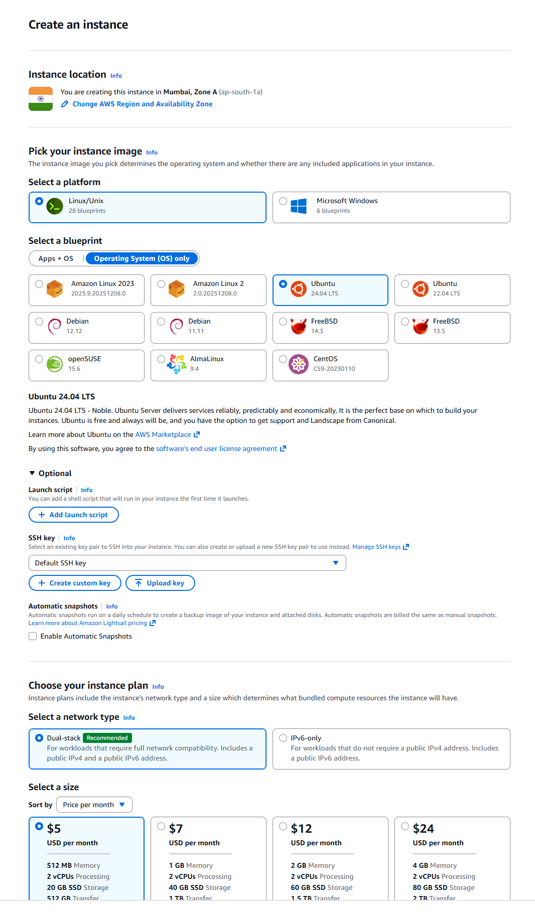
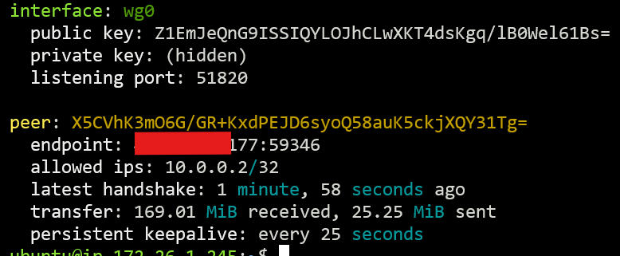
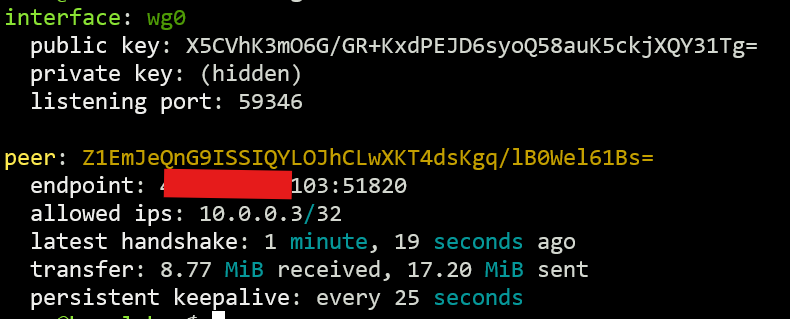

## Available options

Here are a few options I researched for accessing my services outside of my local network.

Port forwarding. We could forward a specific port of the service, or forward 80 and 443 with a reverse proxy in between. This needs a public static IP assigned to our router by the ISP, and the ISP should also allow port forwarding. Generally, for consumer connections, ISPs assign a dynamic IP, and this can change over time. Dynamic DNS kind of services can help with a dynamic IP with a fixed domain name, but port forwarding is also required, which my ISP do not support as well.

Also, this exposes our server to the open internet and makes it a target for possible threats and DDoS attacks.

Another option could be private VPN network solutions like Tailscale, Zerotier, etc. This allows access to all devices connected to the PN network and can only be accessed by the respective VPN. 

The only drawback for me is that this requires the VPN client to be installed on everyone’s device, and I do not want to bother with that.

Cloudflare tunnel is another excellent solution to expose local services via Cloudflare tunnel to a domain.

This is potentially a good option for serving static web servers, admin panels, etc. But for my few cases, where I also want to stream movies, view/download/photos my photos, this goes against Cloudflare’s ToC, they could ban my account.

So, I went with renting a cheap VPS on AWS Lightsail, with 2 vCPUs, 512MB of RAM and 10GB of storage. I will tunnel the VPS and the server over a WireGuard tunnel. The VPS will have the reverse proxy point to the private IP address of the server. The spec is enough just to run a VPN server and a reverse proxy; all the heavy lifting will be done by the server anyway.

## Start up Lightsail

1. Log in to the AWS console and go to the Lightsail dashboard
2. Click on “Create instance”
3. Select region
4. Select platform (Linux)
5. Select blueprint (OS only, Ubuntu 24.04 LTS)
6. Select the size (the cheapest one for me)
7. Give the instance a name (ubuntu)
8. Click on “Create instance”



Once the instance is created, go to the instance dashboard and download the private key file; this will be needed to log in to the instance.

It is important to attach a fixed IP to the server; otherwise, on every restart of the machine, AWS will assign a new IP to the server. Go to the Netwoking tab under the instance dashboard, and select Attach IP. Once the IP is attached, we will have a fixed IP for the server, even on shutdown or reboot.

We can now SSH to the server using the downloaded private key file

```sh
ssh -i ~/LightsailServer.pem ubuntu@43.12.345.67
```

And update the packages

```sh
sudo apt update
sudo apt upgrade
```

Let’s allow the required ports from the Lightsail firewall. In the Network tab under the instance dashboard, we will add a few firewall rules to allow these ports

- 80 (TCP) - HTTP
- 443 (TCP) - HTTPS
- 22 (TCP) - SSH
- 51820 (UDP) - WireGuard VPN will be running on this port, which will be responsible for communicating with our local server

## Set up WireGuard tunnel

Once the VPS is ready, we will set up WireGuard VPN on both the VPS and the local server to create a private VPN tunnel between the VPS and our local server.

*VPS or Server, under square brackets, means where they need to be performed.*

 1. \[VPS, Server\] 

    ```sh
    sudo apt install wireguard
    ```
 2. \[VPS, Server\] Generate a private and public key pair

    ```sh
    wg genkey | tee privatekey | wg pubkey > publickey
    ```
 3. \[VPS\] Create/modify the WireGuard configuration file `/etc/wireguard/wg0.conf` and add this configuration

    ```conf
    [Interface]
    Address = 10.0.0.1/24   # VPS VPN IP
    ListenPort = 51820
    PrivateKey = <VPS private key>
    
    [Peer]
    PublicKey = <Home server public key>
    AllowedIPs = 10.0.0.2/32   # Home server VPN client IP
    PersistentKeepalive = 25
    
    ```
 4. \[VPS\] Enable IP forwarding 

    ```sh
    sudo sysctl -w net.ipv4.ip_forward=1
    sudo sysctl -w net.ipv6.conf.all.forwarding=1
    ```

    Add these settings permanently by uncommenting the line `net.ipv4.ip_forward=1` and `net.ipv6.conf.all.forwarding=1` in `/etc/sysctl.conf` file.
 5. \[VPS\] Enable WireGuard

    ```sh
    sudo wg-quick up wg0
    sudo systemctl enable wg-quick@wg0
    ```
 6. \[VPS\] Verify the config and the peer is added

    ```sh
    sudo wg
    ```

    Should output like this 

    
 7. \[Server\] Create/modify the WireGuard configuration file `/etc/wireguard/wg0.conf` and add this configuration 

    ```conf
    [Interface]
    Address = 10.0.0.2/24   # Home server VPN IP
    PrivateKey = <Home server private key]
    DNS = 10.0.0.2  # Use Pi-hole DNS at home server VPN IP
    
    # Lightsail VPS
    [Peer]
    PublicKey = <VPS public key>
    Endpoint = <VPS public IP>:51820
    AllowedIPs = 10.0.0.1/32
    PersistentKeepalive = 25 
    ```
 8. \[Server\] Enable WireGuard

    ```sh
    sudo wg-quick up wg0
    sudo systemctl enable wg-quick@wg0
    ```
 9. \[Server\] Verify the config and the peer is added

    ```sh
    sudo wg
    ```

    Should output like this

    
10. We can verify the VPN connection by running the ping command from the VPS to the Server and vice versa

    ```sh
    ping 10.0.0.3 # from VPS to server
    # or
    ping 10.0.0.2 # from Server to VPS
    ```

    We should be able to get ping responses from both sides without dropping any packets.

## Reverse proxy

Once the VPN is set up, we now have access to the local server from the VPS. We can verify by running `curl` to any service

```sh
curl 10.0.0.2:8096 # Jellyfin service
```

We should be able to get the Jellyfin HTML response back.

Now, we will set up a reverse proxy to access these services with our domain (*service*.pijushbarik.com).

### Set up Nginx reverse proxy

We will set up Nginx and expose a local service (e.g. Jellyfin), running on port 8096 on our local service, available to the domain `http://jellyfin.pijushbarik.com`.

1. Install Nginx

   ```sh
   sudo apt update
   sudo apt install nginx
   ```
2. Add firewall rules with UFW and enable UFW

   ```sh
   sudo ufw allow 'Nginx Full' # allow http and https
   sudo ufw allow ssh # allow ssh
   sudo ufw allow 51820/udp # allow wireguard vpn port
   sudo ufw enable
   # check ufw status
   sudo ufw status
   ```
3. Create Nginx server block

   ```sh
   sudo vim /etc/nginx/sites/available/jellyfin.pijushbarik.com
   ```
4. Add this config to the file

   ```
   server {
       listen 80;
       listen [::]:80;
   
       server_name jellyfin.pijushbarik.com;
           
       location / {
           proxy_pass app_server_address;
           proxy_set_header Host $http_host;
           proxy_set_header X-Real-IP $remote_addr;
           proxy_set_header X-Forwarded-For $proxy_add_x_forwarded_for;
           proxy_set_header X-Forwarded-Proto $scheme;
       }
   }
   ```
5. To enable the site, let’s make a link (or copy) to the file in the sites-enabled directory

   ```sh
   sudo ln -s /etc/nginx/sites-available/jellyfin.pijushbarik.com /etc/nginx/sites-enabled/
   ```
6. Test the config

   ```sh
   sudo nginx -t
   ```
7. Reload nginx config

   ```sh
   sudo nginx -s reload
   ```
8. Add a DNS “A” record

   ```
   Type: A
   Name: jellyfin
   content: <server ip>
   ```

With this, we will now be able to open the URL `http://jellyfin.pijushbarik.com` and would be able to get the Jellyfin website served from our local server.

### Secure our domain with HTTPS

We will install Certbot to automatically generate a certificate for us from Let’s Encrypt, also it will renew the certificate automatically in the background.

1. Install Certbot with the Nginx plugin

   ```sh
   sudo apt install certbot python3-certbot-nginx
   ```
2. Obtain the certificate

   ```sh
   sudo certbot --nginx -d jellyfin.pijushbarik.com
   ```

   This will generate the certificate, update the Nginx site config to accept HTTPS and redirect traffic from HTTP to HTTPS automatically, and add a background job to renew the certificate automatically.

Once done, we will then have our service on `https://pijushbarik.com`.

Additionally, we can disable the HTTP (port 80) from the firewall rule to disable traffic on the HTTP port once we are done with the HTTPS certificate generation for all our domains.