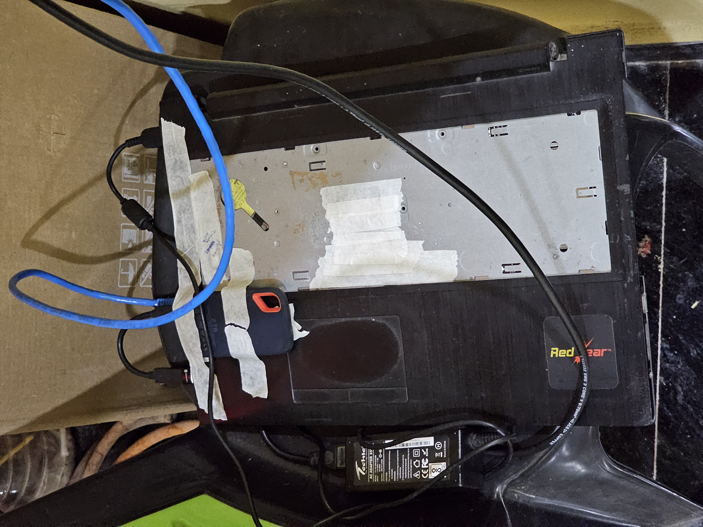

## How it all started

#### Ad blocking

The primary reason to begin the self-hosted journey started with the interest of having my own Pi-Hole server for whole network-wide ad blocking. Either locally or via the internet through a VPN (in the future) to have a free and self-hosted ad blocker for myself and other family members.

#### Photos and backup

To back up all the data, specifically photos (memories to be specific), I heavily relied on Google Photos & Drive. From time to time, I make local backup copies and delete old photos from Google. This had to be done periodically for my other family members, too, and it became painful to do manually.

#### Stream movies and shows

I also needed an easy way to stream movies and shows available locally with other people in my family.

And so I started to research possible solutions, available software, posts and documentation by other people. I came up with this amazing Reddit sub [r/selfhosted](https://www.reddit.com/r/selfhosted/), where I found so many possibilities about how people self-host from their data, photos, streaming server, to email server. And then I got my new and latest hobby, to build my Homelab.

Here I will document the process of setting up my homelab, improving it, adding new features or services, and fixing things in different posts. When there is any change to my setup, I decided not to modify the existing post; instead, I will create another post about it and refer to it in the old post, which could help find what issues I faced earlier and how I resolved them. This blog post is mostly for my own documentation purposes, maybe in future I need it again, quickly copy the Docker Compose for my Jellyfin server.

## Hardware

The primary thing for self-hosting is the hardware: a decent computer and storage (as much as possible).

For the computer part, there are several ways to set up one:

1. **Rent a decent VPS** and storage from cloud service providers like AWS, GCP, Vultr, DigitalOcean, etc, and self-manage your data and services. The data may be hosted locally, but I have not explored this yet.
2. **Buy a Raspberry Pi**, connect external storage with NAS (Network Attached Storage) or DAS (Direct Attached Storage) and connect with LAN to have a local server.
3. **Use an old laptop or desktop** as a local server. Attach a few HDDs or SSDs or a NAS, or DAS. Connect with a LAN and get a local server.

For option 1, accessing your server from the internet is easy. Directly access with the VPS's associated IP address or install a reverse proxy if you have a domain. For options 2 and 3, getting your server to the internet is a little tricky and which I will discuss later. Initially, I will set up everything locally before getting it accessible via the internet with a domain.

I decided to go with option 3, as I already have an old laptop with a broken screen. Except for that, my laptop's specifications are pretty decent, with an Intel i3 5th-generation chip, 8 GB of RAM, and an internal SSD of 240GB. 

For storage, I replaced the old DVD drive with an old 1TB hard disk with a caddy, and added my external 2TB portable SSD (which already contains old photos, movies and other backups) via USB. The internal SSD will work as an OS drive and internal Docker volumes data. I plan to expand the storage with a reliable mirror backup solution in the future.

## Getting the laptop ready

First, I removed the LCD screen from the laptop and made it headless. For OS, I decided to go with Ubuntu Server 24.04.03 LTS.

Here's how it looks as of now


#### OS installation

Created the bootable Ubuntu USB with [Balena Etcher](https://etcher.balena.io/) from my Mac. I won't go into details about how to install Ubuntu Server; there are a lot of guides available on the internet. But here is the disk partition size I decided to go with.

```sh
/boot/efi   vfat    1G # boot loader location
/           ext4   25G # Root, where system data will be
SWAP        SWAP    8G # Same as RAM size
/mnt/data   ext4  189G # Rest of the space for user data
```

During the installation process, it will require internet access. Either could be connected to WiFi or via LAN Ethernet. My laptop was not able to connect to WiFi; it could be a driver issue, I don't know, so I connected through Ethernet. It is also the best practice to keep the server connected via Ethernet instead of WiFi because of reliability.

Create a non-root user

```sh
sudo adduser newusername
```

Set the password and, optionally, additional information. This user can also be added in the installation process. Let's add the user to the sudoers group, so that the user can run sudo commands

```sh
sudo usermod -aG sudo newusername
```

Or, edit the sudoers file

```sh
# after the root user add the new user like this
root           ALL=(ALL:ALL) ALL
newusername    ALL=(ALL:ALL) ALL
```

Then we will log in through the new user account.

#### Docker

We will containerise all of our services with Docker. Let's install Docker

```sh
sudo apt update
sudo apt upgrade
sudo apt install docker.io
sudo apt install docker-compose-v2
```

Once Docker is installed, we need to add the current user to the `docker` group so that running Docker commands every time does not require adding sudo.

```sh
# create the docker group
sudo groupadd docker
# add the user to the docker group
sudo usermod -aG docker $USER
```

## Assign a fixed IP

Once the server is ready, we need to assign a fixed IP to the server, as the router assigns IP addresses dynamically to connected devices, and we do not want to have a dynamic IP address to the server. So, we tell the router to allocate a fixed IP to the server by adding an Address Reservation entry in the router's DHCP Server settings. This will map the MAC address of the server to a fixed IP. I have assigned 192.168.0.153.


## Move Docker Volume

I moved my Docker volume to the data partition (`/mnt/data`) to accommodate the increasing size of the volumes.

1. Stop the Docker service

   ```sh
   sudo systemctl stop docker
   ```
2. Create/Edit the `/etc/docker/daemon.json` configuration file with the location of the new data directory

   ```sh
    { 
        "data-root": "/mnt/data/docker"
    }
   ```
3. \[Optional\] I also added this DNS entry to fix some issues with network unreachable errors for some containers while installing

   ```sh
   "dns": ["192.168.0.1", "8.8.8.8", "8.8.4.4"]
   ```

   This entry can also be added individually to a particular container. Adding here makes the default for all containers.
4. Move the existing volumes' data to the new folder

   ```sh
   rsync -aP /var/lib/docker/ /mnt/data/docker/
   ```
5. To be safe, instead of deleting the old volume data, we will rename it

   ```sh
   mv /var/lib/docker /var/lib/docker.bak
   ```
6. Start Docker service

   ```sh
   sudo systemctl start docker
   ```
7. Once done, we can verify by checking other containers or running this hello world command

   ```sh
   docker run --rm hello-world
   ```
8. If no errors, the volume move is complete, and we can safely delete the old Docker directory

   ```sh
   sudo rm -rf /var/lib/docker.bak
   ```

## Automount drives

By default, Linux does not automount external drives. We can run `mount` command to manually mount a disk. To automate the mounting every time the system reboots, we need to add entries to the `/etc/fstab` file.

1. Get the UUID

   ```sh
   lsblk -f
   ```

   This will show all drives, including the unmounted ones.

   
2. Grab the UUID of the drive (A12B-8FFC) and make an entry to fstab. Open the fstab file

   ```sh
   sudo vim /etc/fstab
   ```
3. Create the mount directory where the drive will be mounted

   ```sh
   mkdir /mnt/extern-hdd1
   ```
4. Add this line at the end of the file

   ```sh
   UUID=A12B-8FFC /mnt/extern-hdd1 ext4 defaults,nofail,x-systemd.device-timeout=10s,x-systemd.automount 0 2
   ```

   See [fstab documentation](https://man7.org/linux/man-pages/man5/fstab.5.html) for fstab options. The option `x-systemd.automount` is used to mount the drive on boot.
5. Repeat this process for other external drives.
6. Mount all drives in fstab

   ```sh
   sudo mount -a
   ```